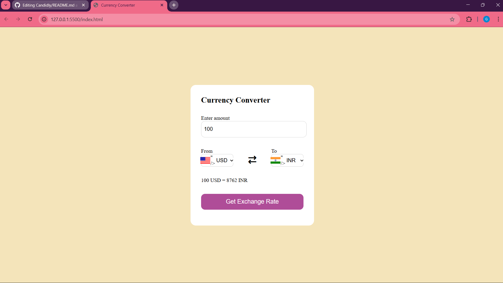

# currency_converter

A simple and user-friendly **Currency Converter Web App** built using **HTML, CSS, and JavaScript**.  
It allows users to convert currencies in real-time with a clean and responsive UI.  

## 🚀 Features
- Enter amount and convert between multiple currencies.
- Displays country flags along with currency codes.
- Swap functionality to switch between "From" and "To" currencies.
- Responsive design for better user experience.
- Easy-to-use interface.

## 🛠️ Technologies Used
- **HTML5** – Structure of the app  
- **CSS3** – Styling and layout  
- **JavaScript (ES6)** – Logic for fetching and displaying exchange rates  
- **Exchange Rate API** – (if you are using any API for real-time data)
